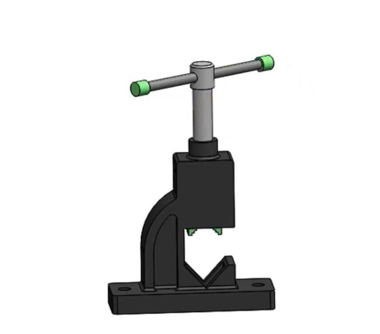
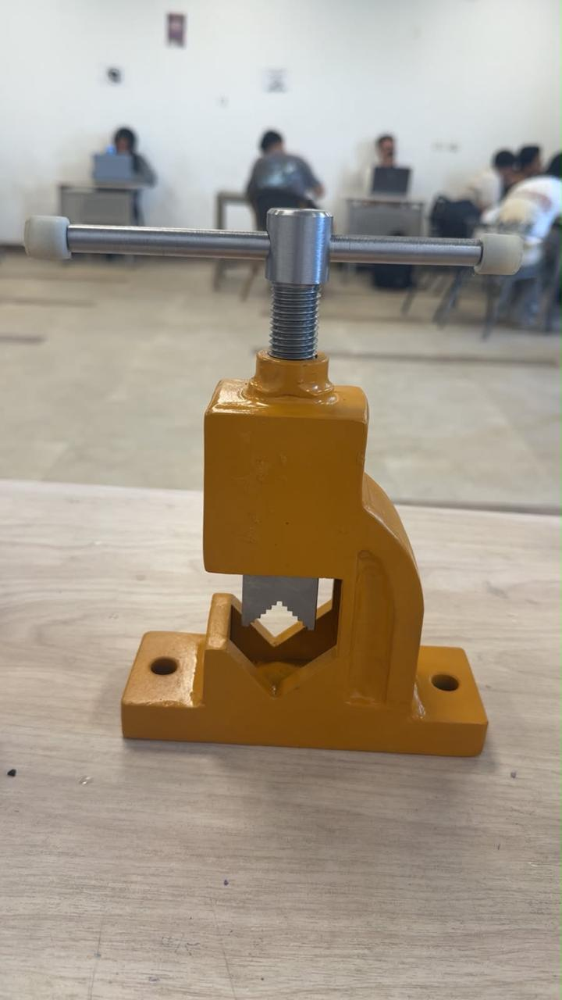
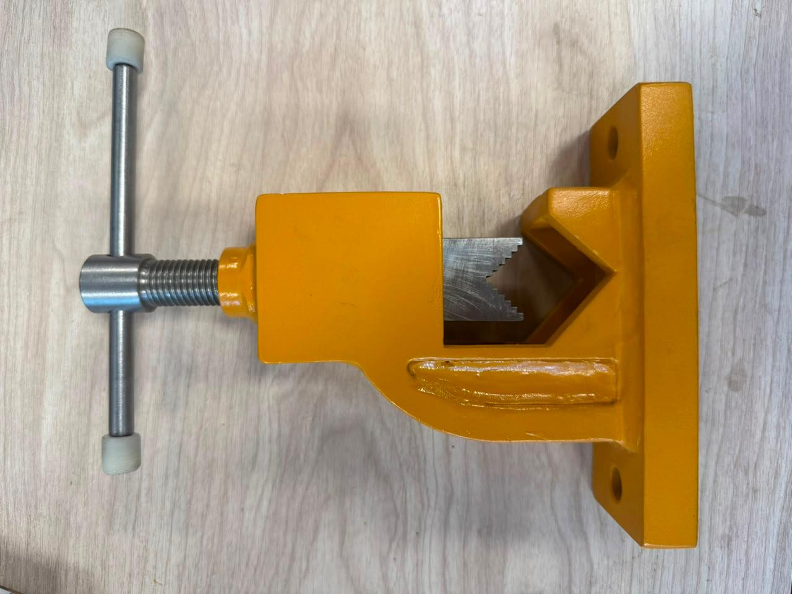
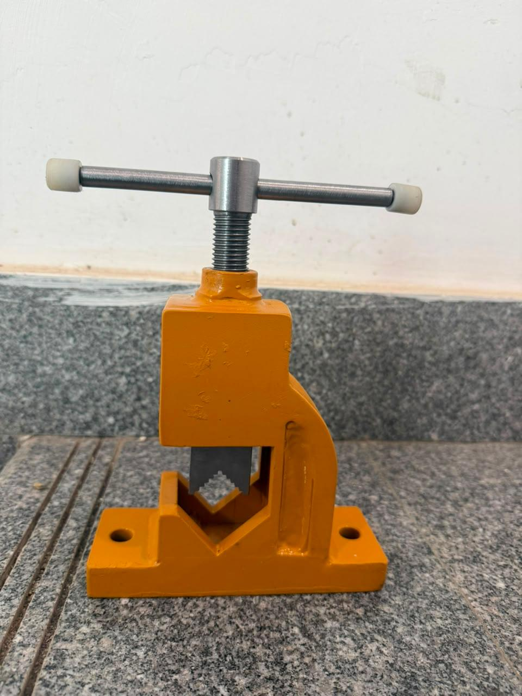

# Mechanical-Clamping-and-Pressing-Tool
## Overview
A Mechanical Clamping and Pressing Tool designed using SolidWorks. This repository contains 3D CAD models, detailed engineering drawings (SLDDRW), export PDFs, and rendering images for assembly and individual parts.

## Project Photos

## Included Files
- **SolidWorks Drawings:** `Part1.SLDDRW`, `Part2...SLDDRW`, `Part3...SLDDRW`
- **PDF Drawings:** `Part1.pdf`, `Part2...pdf`, `Part3...pdf`
